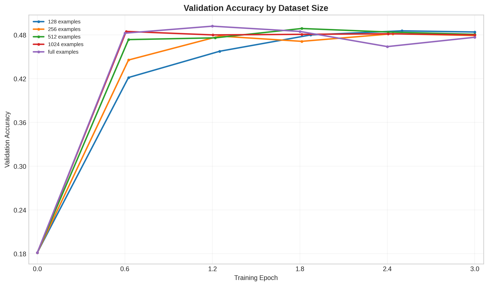
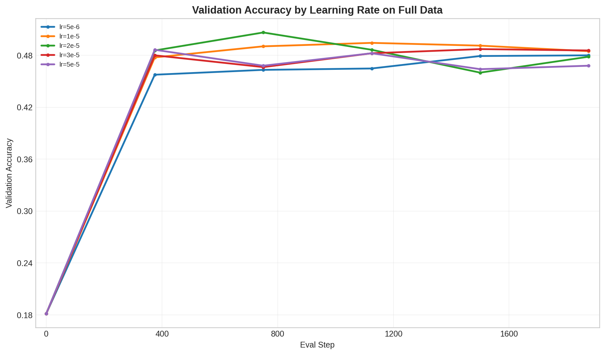
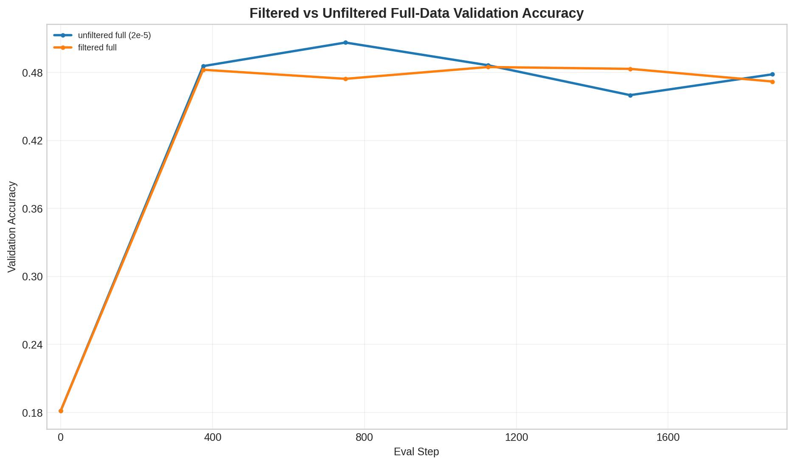

# Section 4 SFT Comparison

## Summary

- Best overall run: `2e-5` on full unfiltered data
- Best overall accuracy: `0.5064`
- Best checkpoint: step `750` at epoch `1.20`
- Best checkpoint path: `data/section4/sft_experiment/section4_sft_all_20260423-0010_norm1_hparam/lr_2em5/unfiltered_full/best_model`
- Final accuracy for that run: `0.4784`

## Auto Commentary

- The strongest unfiltered SFT run was `2e-5` with best validation accuracy 0.5064 at step 750 (epoch 1.20).
- Within the dataset-size sweep, the best run was `full` with best validation accuracy 0.4920, so the full dataset still performed best among the fixed-learning-rate serial runs.
- The filtered-full run kept 9998 examples and reached 0.4848 best validation accuracy, which is -0.0216 relative to the unfiltered full-data `2e-5` run at 0.5064.
- On these artifacts, filtering reduced peak validation accuracy slightly, so the main value of the filtered set would need to come from downstream stability or RL warm-start behavior rather than raw SFT accuracy.

## Dataset Size Sweep

| Dataset Label | Train Examples | Best Accuracy | Final Accuracy | Best Step |
| --- | ---: | ---: | ---: | ---: |
| 128 | 128 | 0.4856 | 0.4840 | 20 |
| 256 | 256 | 0.4816 | 0.4792 | 39 |
| 512 | 512 | 0.4888 | 0.4808 | 58 |
| 1024 | 1024 | 0.4848 | 0.4800 | 39 |
| full | 10000 | 0.4920 | 0.4768 | 750 |

The best dataset-size run among the fixed-`2e-5` serial sweep was `full` with best accuracy `0.4920`.

## Learning Rate Sweep On Full Data

| Learning Rate | Best Accuracy | Final Accuracy | Best Step |
| --- | ---: | ---: | ---: |
| 2e-5 | 0.5064 | 0.4784 | 750 |
| 1e-5 | 0.4944 | 0.4848 | 1125 |
| 3e-5 | 0.4872 | 0.4856 | 1500 |
| 5e-5 | 0.4864 | 0.4680 | 375 |
| 5e-6 | 0.4800 | 0.4800 | 1875 |

## Filtered Full Dataset Experiment

Filtered dataset size: `9998` examples.

| Setting | Train Examples | Best Accuracy | Final Accuracy | Best Step |
| --- | ---: | ---: | ---: | ---: |
| Unfiltered full data, `2e-5` | 10000 | 0.5064 | 0.4784 | 750 |
| Filtered full data, `2e-5` | 9998 | 0.4848 | 0.4720 | 1125 |

Compared to the previous full-data SFT experiment, the filtered-full run changed peak accuracy by `-0.0216`.

