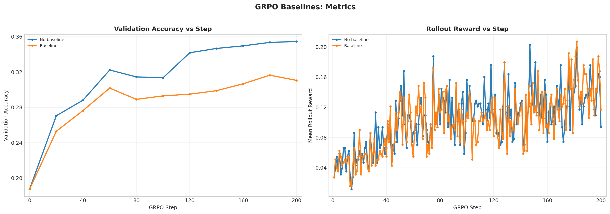

# GRPO Baselines Analysis

Report name:
- `grpo_baselines`

Campaigns:
- `section7_grpo_baselines_20260428_005708`

Summary:
- Best run: `lr_1em05_loss_no_baseline_std_g8_rb256_ep1`
- Best validation accuracy: `0.3545`
- Final validation accuracy for best run: `0.3545`

Generated artifacts:
- `section7_combined_metrics.png`

## Run Table

| Run | Best Accuracy | Final Accuracy | Peak Reward | Final Reward | Avg Response Length | Loss Type | Reward Fn | Length Norm | Std Norm | Epochs | Train Batch | Wall Clock (min) |
| --- | ---: | ---: | ---: | ---: | ---: | --- | --- | --- | --- | ---: | ---: | ---: |
| lr_1em05_loss_no_baseline_std_g8_rb256_ep1 | 0.3545 | 0.3545 | 0.2031 | 0.0938 | 732.6 | no_baseline | r1_zero | masked_mean | True | 1 | 256 | 62.9 |
| lr_1em05_loss_reinforce_with_baseline_std_g8_rb256_ep1 | 0.3164 | 0.3105 | 0.2070 | 0.1172 | 770.2 | reinforce_with_baseline | r1_zero | masked_mean | True | 1 | 256 | 65.1 |

## Figures

## Auto Commentary

- Best observed run was `lr_1em05_loss_no_baseline_std_g8_rb256_ep1` at 0.3545 validation accuracy, ahead of `lr_1em05_loss_reinforce_with_baseline_std_g8_rb256_ep1` by 0.0381.
- `lr_1em05_loss_no_baseline_std_g8_rb256_ep1` stayed stable through the end of training, with only 0.0000 difference between best and final validation accuracy.
- In this campaign, `no_baseline` outperformed `reinforce_with_baseline` by 0.0381 best validation accuracy, while the baseline run held a slightly higher peak rollout reward.

## Deliverable Notes

- `loss_type=no_baseline`: best run `lr_1em05_loss_no_baseline_std_g8_rb256_ep1` reached accuracy 0.3545 and peak rollout reward 0.2031
- `loss_type=reinforce_with_baseline`: best run `lr_1em05_loss_reinforce_with_baseline_std_g8_rb256_ep1` reached accuracy 0.3164 and peak rollout reward 0.2070
