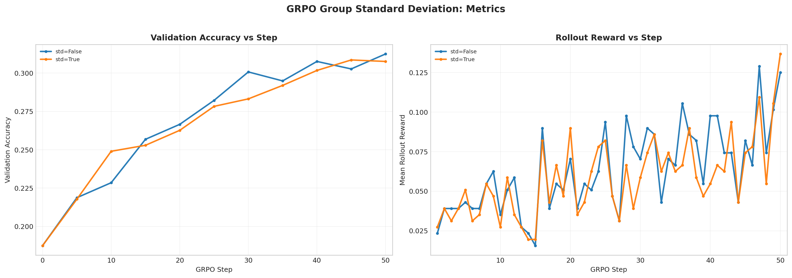

# GRPO Group Standard Deviation Analysis

Report name:
- `grpo_group_standard_deviation`

Campaigns:
- `section7_grpo_stdnorm_20260428_042645`

Summary:
- Best run: `lr_1em05_loss_no_baseline_mean_g8_rb256_ep1`
- Best validation accuracy: `0.3125`
- Final validation accuracy for best run: `0.3125`

Generated artifacts:
- `section7_combined_metrics.png`

## Run Table

| Run | Best Accuracy | Final Accuracy | Peak Reward | Final Reward | Avg Response Length | Loss Type | Reward Fn | Length Norm | Std Norm | Epochs | Train Batch | Wall Clock (min) |
| --- | ---: | ---: | ---: | ---: | ---: | --- | --- | --- | --- | ---: | ---: | ---: |
| lr_1em05_loss_no_baseline_mean_g8_rb256_ep1 | 0.3125 | 0.3125 | 0.1289 | 0.1250 | 888.0 | no_baseline | r1_zero | masked_mean | False | 1 | 256 | 19.4 |
| lr_1em05_loss_no_baseline_std_g8_rb256_ep1 | 0.3086 | 0.3076 | 0.1367 | 0.1367 | 900.9 | no_baseline | r1_zero | masked_mean | True | 1 | 256 | 19.5 |

## Figures

## Auto Commentary

- Best observed run was `lr_1em05_loss_no_baseline_mean_g8_rb256_ep1` at 0.3125 validation accuracy, ahead of `lr_1em05_loss_no_baseline_std_g8_rb256_ep1` by 0.0039.
- `lr_1em05_loss_no_baseline_mean_g8_rb256_ep1` stayed stable through the end of training, with only 0.0000 difference between best and final validation accuracy.

## Deliverable Notes

- `use_std_normalization=False`: best run `lr_1em05_loss_no_baseline_mean_g8_rb256_ep1` reached accuracy 0.3125 and peak rollout reward 0.1289
- `use_std_normalization=True`: best run `lr_1em05_loss_no_baseline_std_g8_rb256_ep1` reached accuracy 0.3086 and peak rollout reward 0.1367
