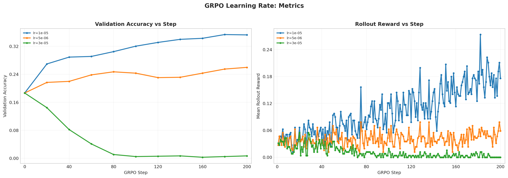

# GRPO Learning Rate Analysis

Report name:
- `grpo_learning_rate`

Campaigns:
- `section7_grpo_learning_rate_20260426_221414`

Summary:
- Best run: `lr_1em05_loss_reinforce_with_baseline_std_g8_rb256_ep1`
- Best validation accuracy: `0.3535`
- Final validation accuracy for best run: `0.3525`

Generated artifacts:
- `section7_combined_metrics.png`

## Run Table

| Run | Best Accuracy | Final Accuracy | Peak Reward | Final Reward | Avg Response Length | Loss Type | Reward Fn | Length Norm | Std Norm | Epochs | Train Batch | Wall Clock (min) |
| --- | ---: | ---: | ---: | ---: | ---: | --- | --- | --- | --- | ---: | ---: | ---: |
| lr_1em05_loss_reinforce_with_baseline_std_g8_rb256_ep1 | 0.3535 | 0.3525 | 0.2734 | 0.1758 | 754.8 | reinforce_with_baseline | r1_zero | masked_mean | True | 1 | 256 | 182.5 |
| lr_5em06_loss_reinforce_with_baseline_std_g8_rb256_ep1 | 0.2598 | 0.2598 | 0.0781 | 0.0586 | 943.6 | reinforce_with_baseline | r1_zero | masked_mean | True | 1 | 256 | 189.6 |
| lr_3em05_loss_reinforce_with_baseline_std_g8_rb256_ep1 | 0.1865 | 0.0068 | 0.0547 | 0.0000 | 598.8 | reinforce_with_baseline | r1_zero | masked_mean | True | 1 | 256 | 177.0 |

## Figures

## Auto Commentary

- Best observed run was `lr_1em05_loss_reinforce_with_baseline_std_g8_rb256_ep1` at 0.3535 validation accuracy, ahead of `lr_5em06_loss_reinforce_with_baseline_std_g8_rb256_ep1` by 0.0938.
- `lr_1em05_loss_reinforce_with_baseline_std_g8_rb256_ep1` stayed stable through the end of training, with only 0.0010 difference between best and final validation accuracy.
- Higher learning-rate settings were unstable here; `lr_3em05_loss_reinforce_with_baseline_std_g8_rb256_ep1` collapsed to final accuracy 0.0068.

## Deliverable Notes

- `lr=1e-05`: best run `lr_1em05_loss_reinforce_with_baseline_std_g8_rb256_ep1` reached accuracy 0.3535 and peak rollout reward 0.2734
- `lr=3e-05`: best run `lr_3em05_loss_reinforce_with_baseline_std_g8_rb256_ep1` reached accuracy 0.1865 and peak rollout reward 0.0547
- `lr=5e-06`: best run `lr_5em06_loss_reinforce_with_baseline_std_g8_rb256_ep1` reached accuracy 0.2598 and peak rollout reward 0.0781
