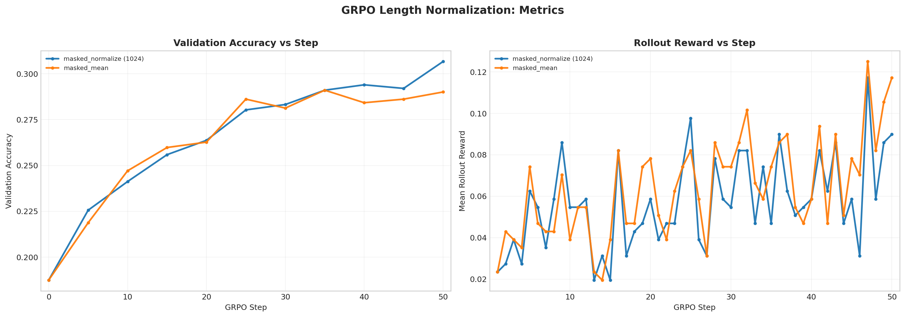

# GRPO Length Normalization Analysis

Report name:
- `grpo_length_normalization`

Campaigns:
- `section7_grpo_lengthnorm_20260428_042640`

Summary:
- Best run: `lr_1em05_loss_no_baseline_std_g8_rb256_ep1_lnorm_const1024`
- Best validation accuracy: `0.3066`
- Final validation accuracy for best run: `0.3066`

Generated artifacts:
- `section7_combined_metrics.png`

## Run Table

| Run | Best Accuracy | Final Accuracy | Peak Reward | Final Reward | Avg Response Length | Loss Type | Reward Fn | Length Norm | Std Norm | Epochs | Train Batch | Wall Clock (min) |
| --- | ---: | ---: | ---: | ---: | ---: | --- | --- | --- | --- | ---: | ---: | ---: |
| lr_1em05_loss_no_baseline_std_g8_rb256_ep1_lnorm_const1024 | 0.3066 | 0.3066 | 0.1172 | 0.0898 | 925.9 | no_baseline | r1_zero | masked_normalize | True | 1 | 256 | 18.7 |
| lr_1em05_loss_no_baseline_std_g8_rb256_ep1 | 0.2910 | 0.2900 | 0.1250 | 0.1172 | 898.6 | no_baseline | r1_zero | masked_mean | True | 1 | 256 | 19.0 |

## Figures

## Auto Commentary

- Best observed run was `lr_1em05_loss_no_baseline_std_g8_rb256_ep1_lnorm_const1024` at 0.3066 validation accuracy, ahead of `lr_1em05_loss_no_baseline_std_g8_rb256_ep1` by 0.0156.
- `lr_1em05_loss_no_baseline_std_g8_rb256_ep1_lnorm_const1024` stayed stable through the end of training, with only 0.0000 difference between best and final validation accuracy.

## Deliverable Notes

- `length_norm=masked_mean, constant=None`: best run `lr_1em05_loss_no_baseline_std_g8_rb256_ep1` reached accuracy 0.2910 and peak rollout reward 0.1250
- `length_norm=masked_normalize, constant=1024.0`: best run `lr_1em05_loss_no_baseline_std_g8_rb256_ep1_lnorm_const1024` reached accuracy 0.3066 and peak rollout reward 0.1172
