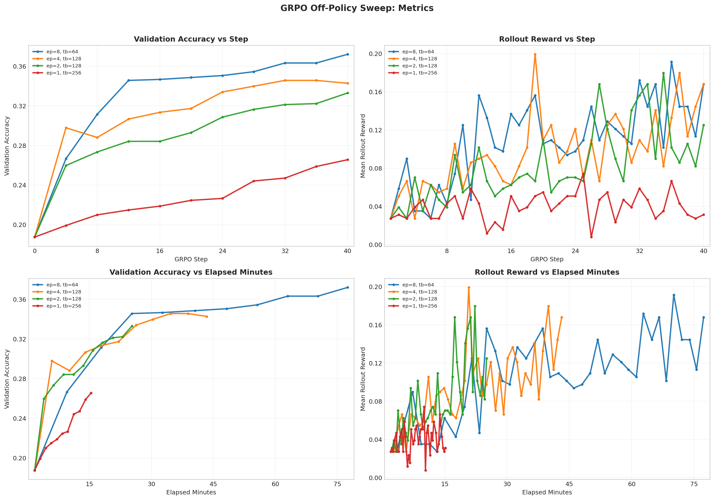

# GRPO Off-Policy Sweep Analysis

Report name:
- `grpo_off_policy_broad`

Campaigns:
- `section7_grpo_offpolicy_broad_20260428_054350`

Summary:
- Best run: `lr_1em05_loss_grpo_clip_mean_g8_rb256_ep8_lnorm_const1024`
- Best validation accuracy: `0.3721`
- Final validation accuracy for best run: `0.3721`

Generated artifacts:
- `section7_combined_metrics.png`

## Run Table

| Run | Best Accuracy | Final Accuracy | Peak Reward | Final Reward | Avg Response Length | Loss Type | Reward Fn | Length Norm | Std Norm | Epochs | Train Batch | Wall Clock (min) |
| --- | ---: | ---: | ---: | ---: | ---: | --- | --- | --- | --- | ---: | ---: | ---: |
| lr_1em05_loss_grpo_clip_mean_g8_rb256_ep8_lnorm_const1024 | 0.3721 | 0.3721 | 0.1914 | 0.1680 | 754.6 | grpo_clip | r1_zero | masked_normalize | False | 8 | 64 | 77.5 |
| lr_1em05_loss_grpo_clip_mean_g8_rb256_ep4_lnorm_const1024 | 0.3457 | 0.3428 | 0.1992 | 0.1680 | 773.2 | grpo_clip | r1_zero | masked_normalize | False | 4 | 128 | 43.4 |
| lr_1em05_loss_grpo_clip_mean_g8_rb256_ep2_lnorm_const1024 | 0.3330 | 0.3330 | 0.1797 | 0.1250 | 831.8 | grpo_clip | r1_zero | masked_normalize | False | 2 | 128 | 25.3 |
| lr_1em05_loss_no_baseline_mean_g8_rb256_ep1_lnorm_const1024 | 0.2656 | 0.2656 | 0.0742 | 0.0312 | 982.2 | no_baseline | r1_zero | masked_normalize | False | 1 | 256 | 15.5 |

## Figures

## Auto Commentary

- Best observed run was `lr_1em05_loss_grpo_clip_mean_g8_rb256_ep8_lnorm_const1024` at 0.3721 validation accuracy, ahead of `lr_1em05_loss_grpo_clip_mean_g8_rb256_ep4_lnorm_const1024` by 0.0264.
- `lr_1em05_loss_grpo_clip_mean_g8_rb256_ep8_lnorm_const1024` stayed stable through the end of training, with only 0.0000 difference between best and final validation accuracy.
- The fastest run was `lr_1em05_loss_no_baseline_mean_g8_rb256_ep1_lnorm_const1024` at 15.5 minutes, while the best-accuracy run took 77.5 minutes.

## Deliverable Notes

- `epochs=1, train_batch=256`: best run `lr_1em05_loss_no_baseline_mean_g8_rb256_ep1_lnorm_const1024` reached accuracy 0.2656 and peak rollout reward 0.0742
- `epochs=2, train_batch=128`: best run `lr_1em05_loss_grpo_clip_mean_g8_rb256_ep2_lnorm_const1024` reached accuracy 0.3330 and peak rollout reward 0.1797
- `epochs=4, train_batch=128`: best run `lr_1em05_loss_grpo_clip_mean_g8_rb256_ep4_lnorm_const1024` reached accuracy 0.3457 and peak rollout reward 0.1992
- `epochs=8, train_batch=64`: best run `lr_1em05_loss_grpo_clip_mean_g8_rb256_ep8_lnorm_const1024` reached accuracy 0.3721 and peak rollout reward 0.1914
