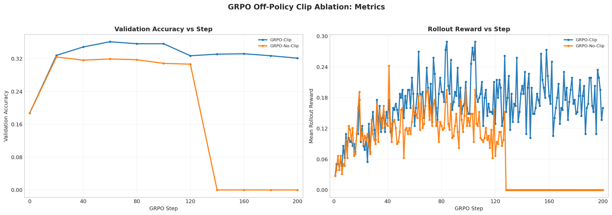

# GRPO Off-Policy Clip Ablation Analysis

Report name:
- `grpo_off_policy_clip_ablation`

Campaigns:
- `section7_grpo_no_clip_20260428_194035`

Summary:
- Best run: `lr_1em05_loss_grpo_clip_mean_g8_rb256_ep4_lnorm_const1024_cfg26f3129b`
- Best validation accuracy: `0.3613`
- Final validation accuracy for best run: `0.3213`

Generated artifacts:
- `section7_combined_metrics.png`

## Run Table

| Run | Best Accuracy | Final Accuracy | Peak Reward | Final Reward | Avg Response Length | Loss Type | Reward Fn | Length Norm | Std Norm | Epochs | Train Batch | Wall Clock (min) |
| --- | ---: | ---: | ---: | ---: | ---: | --- | --- | --- | --- | ---: | ---: | ---: |
| lr_1em05_loss_grpo_clip_mean_g8_rb256_ep4_lnorm_const1024_cfg26f3129b | 0.3613 | 0.3213 | 0.2891 | 0.1602 | 673.5 | grpo_clip | r1_zero | masked_normalize | False | 4 | 128 | 194.7 |
| lr_1em05_loss_grpo_no_clip_mean_g8_rb256_ep4_lnorm_const1024_cfgb25d938c | 0.3242 | 0.0000 | 0.2422 | 0.0000 | 875.7 | grpo_no_clip | r1_zero | masked_normalize | False | 4 | 128 | 183.4 |

## Figures

## Auto Commentary

- Best observed run was `lr_1em05_loss_grpo_clip_mean_g8_rb256_ep4_lnorm_const1024_cfg26f3129b` at 0.3613 validation accuracy, ahead of `lr_1em05_loss_grpo_no_clip_mean_g8_rb256_ep4_lnorm_const1024_cfgb25d938c` by 0.0371.
- The best checkpoint for `lr_1em05_loss_grpo_clip_mean_g8_rb256_ep4_lnorm_const1024_cfg26f3129b` was meaningfully ahead of its final checkpoint by 0.0400, which suggests late-run instability or overtraining.

## Deliverable Notes

- `loss_type=grpo_clip`: best run `lr_1em05_loss_grpo_clip_mean_g8_rb256_ep4_lnorm_const1024_cfg26f3129b` reached accuracy 0.3613 and peak rollout reward 0.2891
- `loss_type=grpo_no_clip`: best run `lr_1em05_loss_grpo_no_clip_mean_g8_rb256_ep4_lnorm_const1024_cfgb25d938c` reached accuracy 0.3242 and peak rollout reward 0.2422
