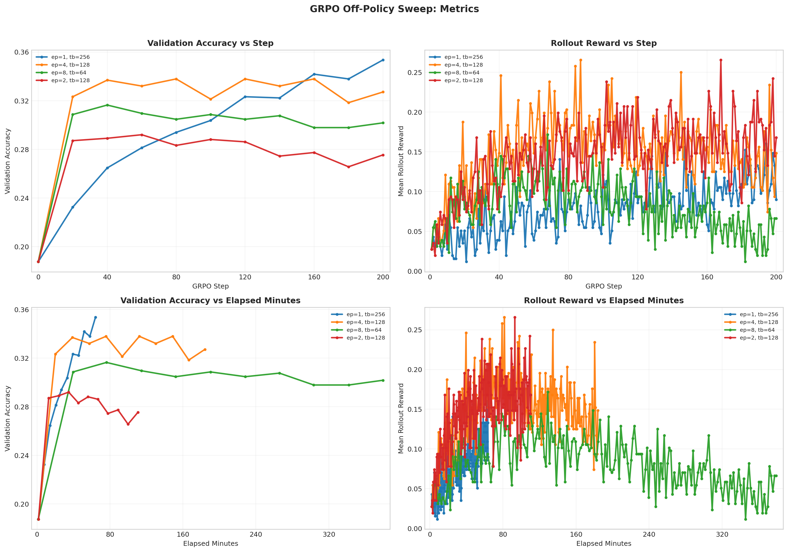

# GRPO Off-Policy Sweep Analysis

Report name:
- `grpo_off_policy_focused`

Campaigns:
- `section7_grpo_offpolicy_focused_20260428_074000`

Summary:
- Best run: `lr_1em05_loss_no_baseline_mean_g8_rb256_ep1_lnorm_const1024_cfg75bb4c87`
- Best validation accuracy: `0.3535`
- Final validation accuracy for best run: `0.3535`

Generated artifacts:
- `section7_combined_metrics.png`

## Run Table

| Run | Best Accuracy | Final Accuracy | Peak Reward | Final Reward | Avg Response Length | Loss Type | Reward Fn | Length Norm | Std Norm | Epochs | Train Batch | Wall Clock (min) |
| --- | ---: | ---: | ---: | ---: | ---: | --- | --- | --- | --- | ---: | ---: | ---: |
| lr_1em05_loss_no_baseline_mean_g8_rb256_ep1_lnorm_const1024_cfg75bb4c87 | 0.3535 | 0.3535 | 0.1602 | 0.0898 | 843.9 | no_baseline | r1_zero | masked_normalize | False | 1 | 256 | 64.2 |
| lr_1em05_loss_grpo_clip_mean_g8_rb256_ep4_lnorm_const1024_cfg26f3129b | 0.3379 | 0.3271 | 0.2656 | 0.1484 | 774.0 | grpo_clip | r1_zero | masked_normalize | False | 4 | 128 | 184.1 |
| lr_1em05_loss_grpo_clip_mean_g8_rb256_ep8_lnorm_const1024_cfg2cccfc8d | 0.3164 | 0.3018 | 0.1719 | 0.0664 | 726.0 | grpo_clip | r1_zero | masked_normalize | False | 8 | 64 | 379.4 |
| lr_1em05_loss_grpo_clip_mean_g8_rb256_ep2_lnorm_const1024_cfg48220316 | 0.2920 | 0.2754 | 0.2656 | 0.1680 | 713.4 | grpo_clip | r1_zero | masked_normalize | False | 2 | 128 | 110.7 |

## Figures

## Auto Commentary

- Best observed run was `lr_1em05_loss_no_baseline_mean_g8_rb256_ep1_lnorm_const1024_cfg75bb4c87` at 0.3535 validation accuracy, ahead of `lr_1em05_loss_grpo_clip_mean_g8_rb256_ep4_lnorm_const1024_cfg26f3129b` by 0.0156.
- `lr_1em05_loss_no_baseline_mean_g8_rb256_ep1_lnorm_const1024_cfg75bb4c87` stayed stable through the end of training, with only 0.0000 difference between best and final validation accuracy.
- The fastest run was `lr_1em05_loss_no_baseline_mean_g8_rb256_ep1_lnorm_const1024_cfg75bb4c87` at 64.2 minutes, while the best-accuracy run took 64.2 minutes.

## Deliverable Notes

- `epochs=1, train_batch=256`: best run `lr_1em05_loss_no_baseline_mean_g8_rb256_ep1_lnorm_const1024_cfg75bb4c87` reached accuracy 0.3535 and peak rollout reward 0.1602
- `epochs=2, train_batch=128`: best run `lr_1em05_loss_grpo_clip_mean_g8_rb256_ep2_lnorm_const1024_cfg48220316` reached accuracy 0.2920 and peak rollout reward 0.2656
- `epochs=4, train_batch=128`: best run `lr_1em05_loss_grpo_clip_mean_g8_rb256_ep4_lnorm_const1024_cfg26f3129b` reached accuracy 0.3379 and peak rollout reward 0.2656
- `epochs=8, train_batch=64`: best run `lr_1em05_loss_grpo_clip_mean_g8_rb256_ep8_lnorm_const1024_cfg2cccfc8d` reached accuracy 0.3164 and peak rollout reward 0.1719
