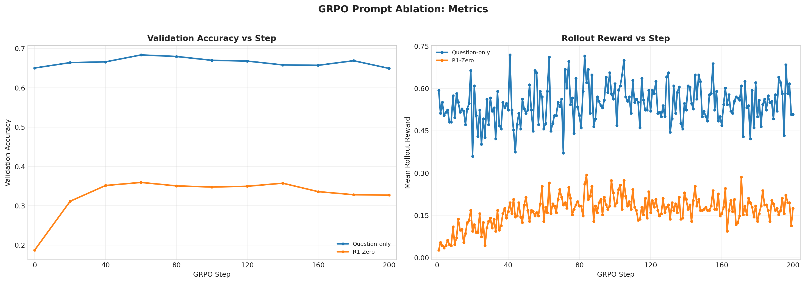

# GRPO Prompt Ablation Analysis

Report name:
- `grpo_prompt_ablation`

Campaigns:
- `section7_grpo_prompt_20260428_194043`

Summary:
- Best run: `lr_1em05_loss_grpo_clip_mean_g8_rb256_ep4_lnorm_const1024_reward_question_only_cfg86b5b0bd`
- Best validation accuracy: `0.6836`
- Final validation accuracy for best run: `0.6494`

Generated artifacts:
- `section7_combined_metrics.png`

## Run Table

| Run | Best Accuracy | Final Accuracy | Peak Reward | Final Reward | Avg Response Length | Loss Type | Reward Fn | Length Norm | Std Norm | Epochs | Train Batch | Wall Clock (min) |
| --- | ---: | ---: | ---: | ---: | ---: | --- | --- | --- | --- | ---: | ---: | ---: |
| lr_1em05_loss_grpo_clip_mean_g8_rb256_ep4_lnorm_const1024_reward_question_only_cfg86b5b0bd | 0.6836 | 0.6494 | 0.7188 | 0.5078 | 1547.7 | grpo_clip | question_only | masked_normalize | False | 4 | 128 | 198.7 |
| lr_1em05_loss_grpo_clip_mean_g8_rb256_ep4_lnorm_const1024_cfg26f3129b | 0.3594 | 0.3271 | 0.2930 | 0.1758 | 663.6 | grpo_clip | r1_zero | masked_normalize | False | 4 | 128 | 189.6 |

## Figures

## Auto Commentary

- Best observed run was `lr_1em05_loss_grpo_clip_mean_g8_rb256_ep4_lnorm_const1024_reward_question_only_cfg86b5b0bd` at 0.6836 validation accuracy, ahead of `lr_1em05_loss_grpo_clip_mean_g8_rb256_ep4_lnorm_const1024_cfg26f3129b` by 0.3242.
- The best checkpoint for `lr_1em05_loss_grpo_clip_mean_g8_rb256_ep4_lnorm_const1024_reward_question_only_cfg86b5b0bd` was meaningfully ahead of its final checkpoint by 0.0342, which suggests late-run instability or overtraining.
- The question-only setup beat the R1-Zero setup by 0.3242 best validation accuracy in this artifact slice.

## Deliverable Notes

- `reward_function=question_only`: best run `lr_1em05_loss_grpo_clip_mean_g8_rb256_ep4_lnorm_const1024_reward_question_only_cfg86b5b0bd` reached accuracy 0.6836 and peak rollout reward 0.7188
- `reward_function=r1_zero`: best run `lr_1em05_loss_grpo_clip_mean_g8_rb256_ep4_lnorm_const1024_cfg26f3129b` reached accuracy 0.3594 and peak rollout reward 0.2930
