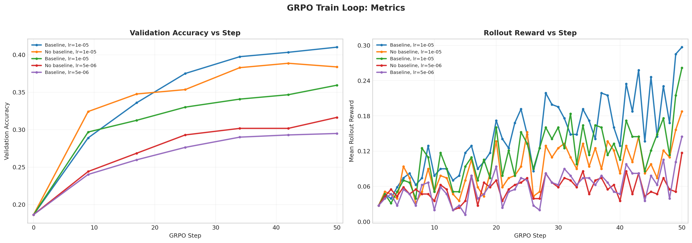

# GRPO Train Loop Analysis

Report name:
- `grpo_train_loop`

Campaigns:
- `section7_grpo_expanded50_20260426_032050_sweep`

Summary:
- Best run: `lr_1em05_loss_reinforce_with_baseline_std_g8_rb256_ep1`
- Best validation accuracy: `0.4102`
- Final validation accuracy for best run: `0.4102`

Generated artifacts:
- `section7_combined_metrics.png`

## Run Table

| Run | Best Accuracy | Final Accuracy | Peak Reward | Final Reward | Avg Response Length | Loss Type | Reward Fn | Length Norm | Std Norm | Epochs | Train Batch | Wall Clock (min) |
| --- | ---: | ---: | ---: | ---: | ---: | --- | --- | --- | --- | ---: | ---: | ---: |
| lr_1em05_loss_reinforce_with_baseline_std_g8_rb256_ep1 | 0.4102 | 0.4102 | 0.2969 | 0.2969 | 817.9 | reinforce_with_baseline | r1_zero | masked_mean | True | 1 | 256 | n/a |
| lr_1em05_loss_no_baseline_std_g8_rb256_ep1 | 0.3887 | 0.3838 | 0.1875 | 0.1875 | 674.5 | no_baseline | r1_zero | masked_mean | True | 1 | 256 | n/a |
| lr_1em05_loss_reinforce_with_baseline_mean_g8_rb256_ep1 | 0.3594 | 0.3594 | 0.2617 | 0.2617 | 837.1 | reinforce_with_baseline | r1_zero | masked_mean | False | 1 | 256 | n/a |
| lr_5em06_loss_no_baseline_std_g8_rb256_ep1 | 0.3164 | 0.3164 | 0.1172 | 0.1172 | 868.8 | no_baseline | r1_zero | masked_mean | True | 1 | 256 | n/a |
| lr_5em06_loss_reinforce_with_baseline_std_g8_rb256_ep1 | 0.2949 | 0.2949 | 0.1445 | 0.1445 | 946.1 | reinforce_with_baseline | r1_zero | masked_mean | True | 1 | 256 | n/a |

## Figures

## Auto Commentary

- Best observed run was `lr_1em05_loss_reinforce_with_baseline_std_g8_rb256_ep1` at 0.4102 validation accuracy, ahead of `lr_1em05_loss_no_baseline_std_g8_rb256_ep1` by 0.0215.
- `lr_1em05_loss_reinforce_with_baseline_std_g8_rb256_ep1` stayed stable through the end of training, with only 0.0000 difference between best and final validation accuracy.

## Deliverable Notes

- Best run for rollout examples: `lr_1em05_loss_reinforce_with_baseline_std_g8_rb256_ep1`

### Step 0
- Reward tuple: total=1.0, format=1.0, answer=1.0
- Problem excerpt: If $\cos \theta = \frac{2}{3},$ then find $\cos 2 \theta.$
- Response excerpt: Since $\cos 2 \theta = 2 \cos^2 \theta - 1$, we can substitute $\cos \theta = \frac{2}{3}$ to get $\cos 2 \theta = 2 \left(\frac{2}{3}\right)^2 - 1 = \frac{8}{9} - 1 = -\frac{1}{9} </think> <answer> $-\frac{1}{9} </answer>

### Step 25
- Reward tuple: total=1.0, format=1.0, answer=1.0
- Problem excerpt: Let $R$ be a unit square region and $n \geq 4$ an integer. A point $X$ in the interior of $R$ is called n-ray partitional if there are $n$ rays emanating from $X$ that divide $R$ into $n$ triangles of equal area. How ...
- Response excerpt: Let $R$ be a unit square region and $n \geq 4$ an integer. A point $X$ in the interior of $R$ is called $n$-ray partitional if there are $n$ rays emanating from $X$ that divide $R$ into $n$ triangles of equal area. How many points are $100$-ray partitional but not $60$-ray partitional?</think> <answer>2320</answer>

### Step 50
- Reward tuple: total=1.0, format=1.0, answer=1.0
- Problem excerpt: Let $R$ be a unit square region and $n \geq 4$ an integer. A point $X$ in the interior of $R$ is called n-ray partitional if there are $n$ rays emanating from $X$ that divide $R$ into $n$ triangles of equal area. How ...
- Response excerpt: Let $R$ be a unit square region and $n \geq 4$ an integer. A point $X$ in the interior of $R$ is called $n$-ray partitional if there are $n$ rays emanating from $X$ that divide $R$ into $n$ triangles of equal area. How many points are $100$-ray partitional but not $60$-ray partitional?</think> <answer>2320</answer>
